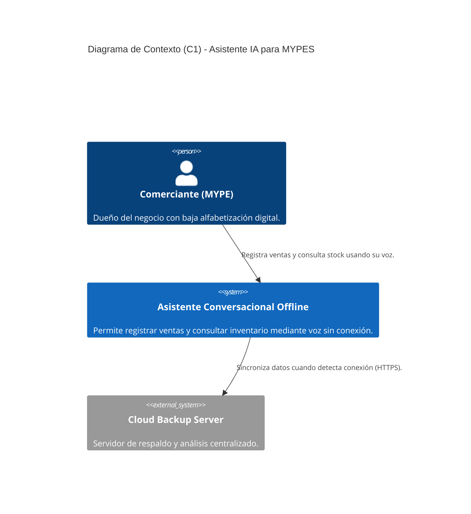
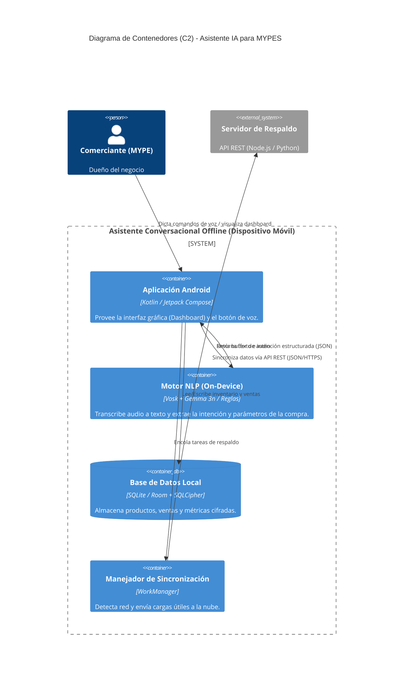

# 4. Arquitectura de Software y Diseño UX/UI

Este documento consolida el SAD (Software Architecture Document) en su etapa inicial, abordando decisiones arquitectónicas y lineamientos de interacción de usuario (Figma).

## 4.1 Atributos de Calidad Priorizados

| Atributo | Prioridad | Justificación |
| :--- | :--- | :--- |
| **Disponibilidad** | Alta | El sistema debe funcionar en un contexto sin conexión a internet constante (Offline-first). |
| **Rendimiento** | Alta | Los dispositivos objetivo tienen memoria RAM muy limitada (< 2GB) y procesadores antiguos. |
| **Usabilidad** | Alta | Los usuarios tienen muy baja alfabetización digital; requieren interacción por voz intuitiva. |
| **Seguridad** | Media | Se requiere proteger la información financiera y de inventario a nivel local. |

## 4.2 Escenarios de Calidad

| ID | Atributo | Fuente | Estímulo | Entorno | Respuesta | Medida |
| :--- | :--- | :--- | :--- | :--- | :--- | :--- |
| **QS-01** | Rendimiento | Usuario | Dicta un comando de voz | Operación normal | Transcribe y procesa el texto | ≤ 2 segundos |
| **QS-02** | Disponibilidad | Sistema operativo | Se pierde la conexión Wi-Fi/Datos | Operación normal | El sistema cambia a modo 100% local | Sin interrupción visible |
| **QS-03** | Usabilidad | Usuario (1ra vez) | Abre la app para registrar venta | Operación normal | Encuentra la acción de dictar voz | Máximo 2 clics |
| **QS-04** | Seguridad | Tercero | Intenta leer la BD del celular (robo) | Dispositivo perdido | La BD local impide lectura directa | Cifrado AES-256 activo |
| **QS-05** | Disponibilidad | Sistema Operativo | Retorna conexión a internet | Operación normal | Sincroniza datos en segundo plano | 100% registros subidos |

## 4.3 Tácticas Arquitectónicas

| Atributo | Problema | Táctica | Justificación |
| :--- | :--- | :--- | :--- |
| Disponibilidad | Fallo/Ausencia de red | **Local Data / Offline-First** | Permite operar el core del negocio localmente usando SQLite/Room. |
| Rendimiento | Modelos IA muy pesados | **Model Quantization** | Uso de Gemma 3n y Vosk cuantizados para caber en memoria RAM reducida. |
| Usabilidad | Dificultad para navegar GUI | **Voice-User Interface (VUI)** | Reemplaza clics y tipeo por procesamiento de lenguaje natural. |
| Seguridad | Datos expuestos en el equipo | **Data Encryption en Reposo** | Uso de SQLCipher para proteger la base de datos local. |

## 4.4 Decisiones Arquitectónicas (ADRs)

### ADR-001: Arquitectura Offline-First
*   **Contexto:** Los usuarios en Vinto sufren de conectividad intermitente y no pueden depender de APIs cloud para registrar ventas diarias.
*   **Decisión:** Adoptar un enfoque *Offline-First* donde la base de datos maestra operativa es la local (SQLite/Room), utilizando sincronización asíncrona hacia la nube.
*   **Justificación:** Garantiza la operatividad ininterrumpida.
*   **Consecuencias:** Añade complejidad técnica para la resolución de conflictos al sincronizar datos hacia el servidor central.

### ADR-002: Procesamiento NLP en el Dispositivo (On-Device)
*   **Contexto:** Mandar audios a la nube para Speech-to-Text consume datos y requiere internet.
*   **Decisión:** Utilizar el modelo Vosk de 50MB para reconocimiento de voz en español y Gemma 3n (si es soportado, o reglas heurísticas como alternativa temporal) directamente en el celular.
*   **Consecuencias:** Obliga a optimizar severamente el uso de la batería y la RAM.

---

## 4.5 Representación C4

### Diagrama C1 - Contexto del Sistema

### Diagrama C2 - Contenedores

---

## 4.6 Diseño UX/UI (Directrices para Figma)
De acuerdo a los requisitos de la materia de **Tecnologías en Internet**:

1.  **Arquitectura de la Información:**
    *   **Usuarios:** Mapear el "Persona" de Don Juan (dueño de abarrotes, 55 años, usa celular solo para WhatsApp).
    *   **Mapa de sitio:** Muy plano. Dashboard -> Pantalla de Escucha -> Catálogo.
2.  **Sistema de Diseño:**
    *   **Colores:** Alto contraste. Botón principal (Micrófono) en color primario llamativo (Ej. Verde esmeralda o Azul fuerte) con retroalimentación visual al hablar (ondas).
    *   **Tipografía:** Tamaños grandes (H1 y Body grandes) para fácil legibilidad en pantallas de gama baja.
3.  **Prototipado:**
    *   Debe enfocarse en **Mobile First** (375px / 390px).
    *   Interfaces no sobrecargadas: Priorizar el reconocimiento de voz sobre la navegación manual por categorías.
