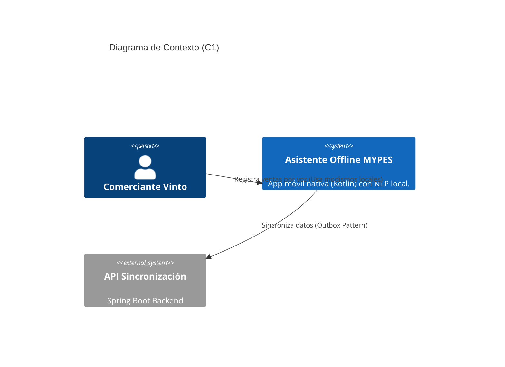
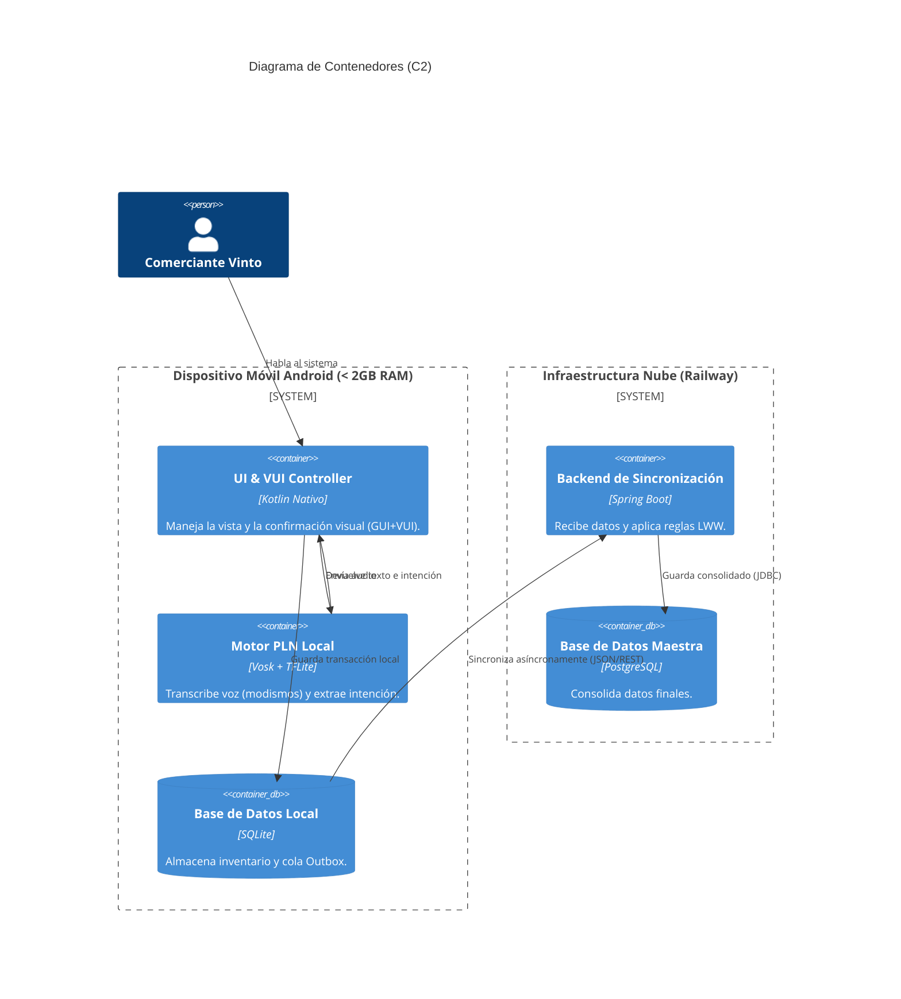

# DOCUMENTO B: SOFTWARE ARCHITECTURE DOCUMENT (SAD v1.0)

**PORTADA**
**UNIVERSIDAD ADVENTISTA DE BOLIVIA**
**INGENIERÍA EN SISTEMAS**
**ARQUITECTURA DE SOFTWARE**

**PROYECTO INTEGRADOR SEMESTRAL**

**SISTEMA:** Asistente Conversacional Offline con Procesamiento de Lenguaje Natural para la Gestión de MYPES en Vinto
**DOCUMENTO:** Software Architecture Document (SAD) — Versión 1.0

**INTEGRANTES:** [Nombres]
**DOCENTE:** [Nombre del Docente]
**FECHA:** [Fecha]
**VERSIÓN:** 1.0

---

## 1. INTRODUCCIÓN
El presente documento describe la arquitectura inicial del Asistente Conversacional Offline con Procesamiento de Lenguaje Natural para la gestión de ventas e inventario en las MYPES del centro de Vinto, Cochabamba. El sistema está diseñado en **Kotlin Nativo** para operar en dispositivos Android de gama baja (menos de 2 GB de RAM), sin conexión a Internet, garantizando un consumo menor a 500 MB de RAM.

Esta versión presenta el análisis del problema corregido metodológicamente, stakeholders, drivers arquitectónicos, tácticas (incluyendo mitigación de ruido ambiental), decisiones iniciales (ADRs simplificados) y la representación modelo C4.

---

## 2. ANÁLISIS DEL PROBLEMA

### 2.1 Contexto
El municipio de Vinto concentra microempresas familiares que operan con flujo de caja diario. Los comerciantes poseen teléfonos Android de gama baja con conectividad intermitente y baja alfabetización digital.

### 2.2 Problema Principal
Los sistemas de gestión comercial actuales (Odoo, ERPNext, MultiCont) requieren competencias digitales que los comerciantes de Vinto no poseen, hardware moderno (mínimo 4 GB RAM) y conexión permanente. 

**Formulación del problema:**
La baja alfabetización digital de los comerciantes del centro de Vinto, sumada a la limitada capacidad de RAM de sus dispositivos y la conectividad intermitente, provoca el rechazo de los sistemas de gestión **debido a la inadecuación de las arquitecturas de software comerciales frente a estas restricciones técnicas y a la imposibilidad de interacción mediante lenguaje natural en las herramientas actuales**, perpetuando procesos ineficientes y pérdida de trazabilidad.

### 2.3 Causas y Consecuencias
* **Causas:** Interfaces gráficas complejas, hardware exigente, dependencia del internet.
* **Consecuencias:** Abandono de sistemas, uso de cuadernos/calculadoras, errores de cálculo, mercancía vencida.

---

## 3. STAKEHOLDERS
| Stakeholder | Rol | Responsabilidad / Interés |
| :--- | :--- | :--- |
| **Comerciantes Vinto** | Usuario final | Registrar ventas por voz, consultar stock. |
| **Desarrolladores** | Equipo | Implementar arquitectura Kotlin nativa y NLP edge. |
| **Docentes UAB** | Evaluador | Validar cumplimiento técnico y metodológico. |

---

## 4. ALCANCE
* **Incluido:** Arquitectura offline-first nativa. Pipeline de PLN local (ASR con Vosk, NLU con TFLite). Sincronización Outbox pattern simple. Confirmación Visual (VUI+GUI).
* **Stretch Goal (Opcional):** Modelo Gemma 3n (solo si las pruebas de rendimiento RAM lo permiten).
* **Excluido:** Pasarelas de pago, soporte iOS, BI avanzado.

---

## 5. REQUISITOS ARQUITECTÓNICAMENTE SIGNIFICATIVOS
| ID | Requisito | Impacto Arquitectónico | Prioridad |
| :--- | :--- | :--- | :--- |
| **RA-01** | Operación offline en Android gama baja (<500MB RAM) | Desarrollo en **Kotlin Nativo** (descartando PWA/Híbridos). | Alta |
| **RA-02** | Ejecutar PLN on-device eficientemente | Uso de modelos ultraligeros: **Vosk (~50MB)** + TFLite. | Alta |
| **RA-03** | Sincronización diferida sin sobrecarga | Patrón **Outbox Simple** + LWW con Backend Spring Boot. | Alta |

---

## 6. ATRIBUTOS Y ESCENARIOS DE CALIDAD

| ID | Atributo | Estímulo | Entorno | Respuesta | Medida |
| :--- | :--- | :--- | :--- | :--- | :--- |
| **QS-01** | Rendimiento | Dicta una venta | App en Android 2GB RAM | Procesa voz y guarda localmente | Consumo RAM < 500MB, latencia ≤ 2s |
| **QS-02** | Confiabilidad | Dicta venta con ruido (Mercado) | Vinto (entorno ruidoso) | App entiende modismos y pide confirmación visual | 90% precisión en modismos locales |
| **QS-03** | Usabilidad | Usuario usa app vs cuaderno | Operación diaria | Registra venta más rápido que a mano | Mejora de **Eficiencia** (Tiempo) |

---

## 7. TÁCTICAS ARQUITECTÓNICAS (Mitigación de Riesgos)

| Atributo | Problema | Táctica Aplicada |
| :--- | :--- | :--- |
| **Rendimiento** | Consumo excesivo de RAM | **Uso de Kotlin Nativo:** Permite control directo del ciclo de vida del micrófono y memoria. |
| **Usabilidad (Ruido)** | Errores de Voz por ruido ambiental | **Fine-Tuning de Vocabulario Dinámico:** Entrenamiento de Vosk con modismos locales ("yapa", "casera", "fiado"). |
| **Confiabilidad** | El NLP asume datos incorrectos | **Confirmación Visual Híbrida (VUI + GUI):** El sistema muestra una tarjeta grande antes de guardar en SQLite. |

---

## 8. DECISIONES ARQUITECTÓNICAS (ADRs)

### ADR-001: Arquitectura Nativa vs Híbrida
* **Decisión:** Desarrollar en **Kotlin Nativo**. Se descarta explícitamente PWA o React Native para garantizar el cumplimiento estricto del límite de 500MB de RAM.

### ADR-002: Pipeline PLN On-Device Ligero
* **Decisión:** Utilizar **Vosk (50MB)** para Speech-to-Text y **TensorFlow Lite** para clasificar intenciones. Gemma 3n pasa a ser un objetivo opcional para no saturar la memoria de los dispositivos objetivo.

### ADR-003: Simplificación de la Arquitectura de Sincronización
* **Decisión:** Se utilizará un **Outbox Pattern simple** con SQLite local. El Backend (Spring Boot) aplicará resolución de conflictos **LWW (Last Write Wins)** y reconciliación manual.
* **Justificación:** Se elimina el uso sobredimensionado de Axon Framework/CQRS para garantizar la entrega a tiempo del proyecto semestral.

---

## 9. MODELO C4

### 9.1 C1 - Contexto

### 9.2 C2 - Contenedores

---
*Fin del Documento B - Preparado para presentación.*
