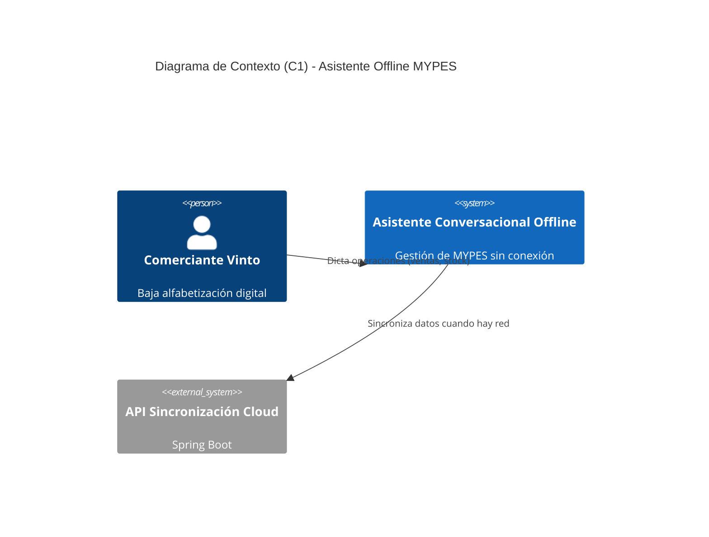
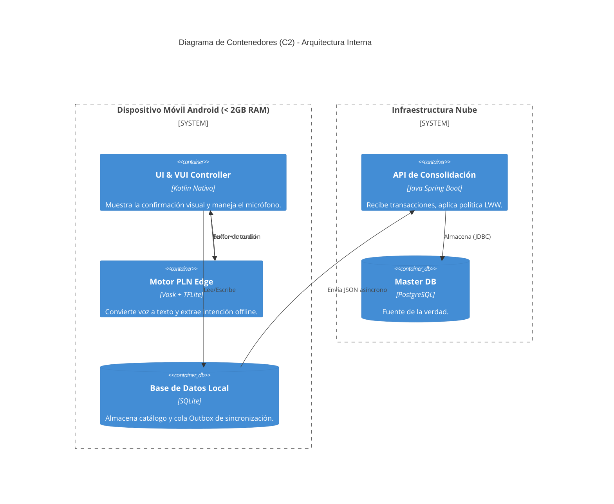

# DOCUMENTO DE ARQUITECTURA DE SOFTWARE (SAD v1.0)

**UNIVERSIDAD ADVENTISTA DE BOLIVIA**  
**INGENIERÍA EN SISTEMAS**  
**ARQUITECTURA DE SOFTWARE**  

**PROYECTO INTEGRADOR SEMESTRAL**  
**SISTEMA:** Asistente Conversacional Offline con Procesamiento de Lenguaje Natural para la Gestión de MYPES en Vinto  
**INTEGRANTES:** [Nombre 1], [Nombre 2], [Nombre 3]  
**DOCENTE:** [Nombre del Docente]  
**FECHA:** [Fecha de Entrega]  
**VERSIÓN:** 1.0  

---

## CONTROL DE VERSIONES
| Versión | Fecha | Autor | Descripción del Cambio |
| :--- | :--- | :--- | :--- |
| 1.0 | [Fecha] | Equipo de Proyecto | Versión inicial del SAD. Cumplimiento de rúbrica de 1ra entrega. |

---

## 1. INTRODUCCIÓN
El presente documento describe la arquitectura inicial del Asistente Conversacional Offline con Procesamiento de Lenguaje Natural para la gestión de ventas e inventario en las MYPES del centro de Vinto, Cochabamba. El sistema está diseñado en tecnologías nativas (Kotlin) para operar en dispositivos Android de gama baja, garantizando un consumo menor a 500 MB de RAM y operación 100% offline.

## 2. ANÁLISIS DEL PROBLEMA
### 2.1 Contexto
Vinto concentra microempresas familiares que operan con flujo de caja diario. Los comerciantes poseen teléfonos Android de gama baja (≤ 2GB RAM), conectividad intermitente y baja alfabetización digital.

### 2.2 Problema Principal
El abandono de los sistemas de gestión comercial por parte de los comerciantes de Vinto ocurre **debido a la inadecuación de las arquitecturas de software comerciales frente a estas restricciones técnicas y a la imposibilidad de interacción mediante lenguaje natural** en las herramientas actuales. Esto perpetúa el uso del cuaderno, causando errores de cálculo y pérdida de trazabilidad.

### 2.3 Causas y Consecuencias
*   **Causas:** Interfaces gráficas (GUI) complejas; sistemas que exigen hardware superior a 4GB RAM y conexión a Internet permanente.
*   **Consecuencias:** Errores de contabilidad manual, mercadería vencida, decisiones financieras a ciegas.

### 2.4 Oportunidad de Solución
La evolución de la Inteligencia Artificial "Edge" (on-device) permite incrustar modelos de reconocimiento de voz (Vosk) e intención (TFLite) que pesan menos de 50MB, habilitando una interfaz conversacional local.

## 3. STAKEHOLDERS
| Stakeholder | Rol | Responsabilidad / Interés |
| :--- | :--- | :--- |
| **Comerciantes Vinto** | Usuario Final | Registrar ventas, controlar stock de forma verbal e intuitiva. |
| **Dueños de Negocios** | Beneficiario | Toma de decisiones, reducir pérdidas de mercadería. |
| **Desarrolladores** | Equipo Técnico | Implementar arquitectura Kotlin nativa, PLN y sincronización. |
| **Docentes UAB** | Evaluador | Validar cumplimiento técnico, rigor arquitectónico y viabilidad. |

## 4. ALCANCE
*   **Incluido:** Arquitectura offline-first nativa. Pipeline de PLN local (ASR con Vosk, NLU con TFLite). Sincronización diferida mediante Outbox Pattern y resolución LWW. Confirmación Visual en pantalla.
*   **Excluido:** Pasarelas de pago online, soporte para iOS o Windows, análisis BI complejo. (El modelo Gemma 3n se considera un reto/stretch goal opcional).

## 5. REQUISITOS ARQUITECTÓNICAMENTE SIGNIFICATIVOS (Drivers)
| ID | Requisito | Impacto Arquitectónico | Prioridad |
| :--- | :--- | :--- | :--- |
| **RA-01** | Soportar operación 100% offline en Android gama baja | Define Kotlin Nativo y persistencia local (SQLite). Descartando PWA o web. | Alta |
| **RA-02** | Procesar voz a texto en el dispositivo sin red | Define la integración del modelo Vosk (~50MB) incrustado en el APK. | Alta |
| **RA-03** | Evitar inconsistencias al recuperar el Internet | Obliga a usar un Outbox Pattern y resolver conflictos en el Backend. | Alta |
| **RA-04** | Tiempo de respuesta de procesamiento verbal ≤ 2s | Fuerza la optimización de latencia en la capa de PLN. | Alta |
| **RA-05** | Permitir futuros módulos (Ej. Reportes avanzados) | Requiere diseño modular y encapsulamiento (Clean Architecture). | Media |

## 6. ATRIBUTOS DE CALIDAD PRIORIZADOS
| Atributo | Prioridad | Justificación |
| :--- | :--- | :--- |
| **Disponibilidad** | Alta | El sistema debe funcionar en el mercado sin depender de datos móviles. |
| **Rendimiento** | Alta | La interacción conversacional fluida exige respuestas en ≤ 2s y <500MB RAM. |
| **Confiabilidad** | Alta | El sistema debe interpretar bien a pesar del ruido ambiental y modismos locales. |
| **Usabilidad** | Alta | Dirigido a usuarios no tecnológicos; la voz reemplaza formularios complejos. |

## 7. ESCENARIOS DE CALIDAD
| ID | Atributo | Fuente | Estímulo | Entorno | Respuesta | Medida |
| :--- | :--- | :--- | :--- | :--- | :--- | :--- |
| **QS-01** | Rendimiento | Usuario | Dicta un comando largo | App en uso | Transcribe y extrae entidades | ≤ 2 s de latencia |
| **QS-02** | Disponib. | Usuario | App iniciada sin WiFi | Sin red | Todas las vistas y SQLite operan | 100% de éxito |
| **QS-03** | Confiabil. | Ruido Ext. | Dicta venta en mercado | Ruido | El sistema extrae datos correctos | Precisión ≥ 85% |
| **QS-04** | Seguridad | Ladrón | Robo del dispositivo | Apagado | Base de datos local ilegible | SQLCipher AES-256 |
| **QS-05** | Usabilidad | Usuario | Uso por primera vez | Venta | El usuario registra sin ayuda | ≥ 70 pts (SUS) |

## 8. TÁCTICAS ARQUITECTÓNICAS
| Atributo | Problema | Táctica Seleccionada | Justificación |
| :--- | :--- | :--- | :--- |
| **Rendimiento** | Limitación de RAM (<2GB) | **Desarrollo Nativo (Kotlin)** | Acceso a bajo nivel para gestionar memoria (Garbage Collection). |
| **Disponibilidad** | Sin conexión a Internet | **Offline-First (Base Embebida)** | Operar contra SQLite local como fuente de verdad temporal. |
| **Confiabilidad** | Ruido asume falsos positivos | **Confirmación Visual Obligatoria** | Tarjeta UI enorme antes de hacer COMMIT en la base de datos. |
| **Confiabilidad** | Modismos no reconocidos | **Vocabulario Dinámico (Fine-tuning)**| Configurar Vosk para palabras "yapa", "casera", "fiado". |

## 9. DECISIONES ARQUITECTÓNICAS INICIALES (ADRs)

### ADR-001: Tecnología Móvil (Nativo vs Híbrido)
*   **Contexto:** Los dispositivos de Vinto tienen severas restricciones de RAM.
*   **Decisión:** Utilizar **Kotlin Nativo**.
*   **Alternativas:** React Native, Flutter, PWA.
*   **Justificación:** PWA y los frameworks híbridos sobrecargan la memoria (WebView/Bridge). Kotlin garantiza el cumplimiento de <500MB de RAM.
*   **Consecuencias:** Desarrollo acoplado a Android. No habrá versión web/iOS.

### ADR-002: Pipeline PLN (Cloud vs Edge)
*   **Contexto:** Transcribir voz a texto tradicionalmente usa Google Cloud, exigiendo Internet.
*   **Decisión:** Utilizar modelo **Vosk** y **TFLite** de forma incrustada (On-Device).
*   **Alternativas:** API de Google Speech, OpenAI Whisper Cloud.
*   **Justificación:** Garantiza la disponibilidad offline, privacidad y costo cero por transacción.
*   **Consecuencias:** Aumenta el peso de la APK (~70MB iniciales).

### ADR-003: Arquitectura de Sincronización
*   **Contexto:** El usuario genera datos offline y luego se conecta a red.
*   **Decisión:** Patrón **Outbox Simple** (SQLite) con resolución **LWW (Last Write Wins)** en Backend Spring Boot.
*   **Alternativas:** CQRS con Axon Framework, Couchbase Sync.
*   **Justificación:** Axon añade demasiada complejidad para el equipo en un semestre. Outbox + LWW es robusto y lograble.
*   **Consecuencias:** Conflictos extremadamente raros requerirán reconciliación manual administrativa.

## 10. MODELO C4
*(Los diagramas C4 están codificados en formato Mermaid y se renderizan automáticamente en GitHub).*

### 10.1 C1 - Diagrama de Contexto

### 10.2 C2 - Diagrama de Contenedores

## 11. TRAZABILIDAD ARQUITECTÓNICA
| Requisito | Atributo | Escenario | Táctica | Decisión | Contenedor C2 |
| :--- | :--- | :--- | :--- | :--- | :--- |
| RA-01 | Disponibilidad | QS-02 | Offline-first | ADR-001 | SQLite (Local) |
| RA-02 | Rendimiento | QS-01 | Procesamiento Local | ADR-002 | Motor PLN Edge |
| RA-03 | Confiabilidad | QS-03 | Outbox + LWW | ADR-003 | API Spring Boot |

## 12. RETOS ARQUITECTÓNICOS
1.  **Reducir tiempos de respuesta en hardware limitado:** Lograr que la inferencia del modelo Vosk tarde menos de 2s en procesadores Mediatek antiguos.
2.  **Soportar sincronización segura (Data Consistency):** Asegurar que las ventas offline no causen inventario negativo irresoluble al volcarse a PostgreSQL.
3.  **Garantizar usabilidad (Voice Risks):** Validar qué hacer cuando la IA comprende erróneamente un dictado numérico clave (Solución implementada: Confirmación Visual).
