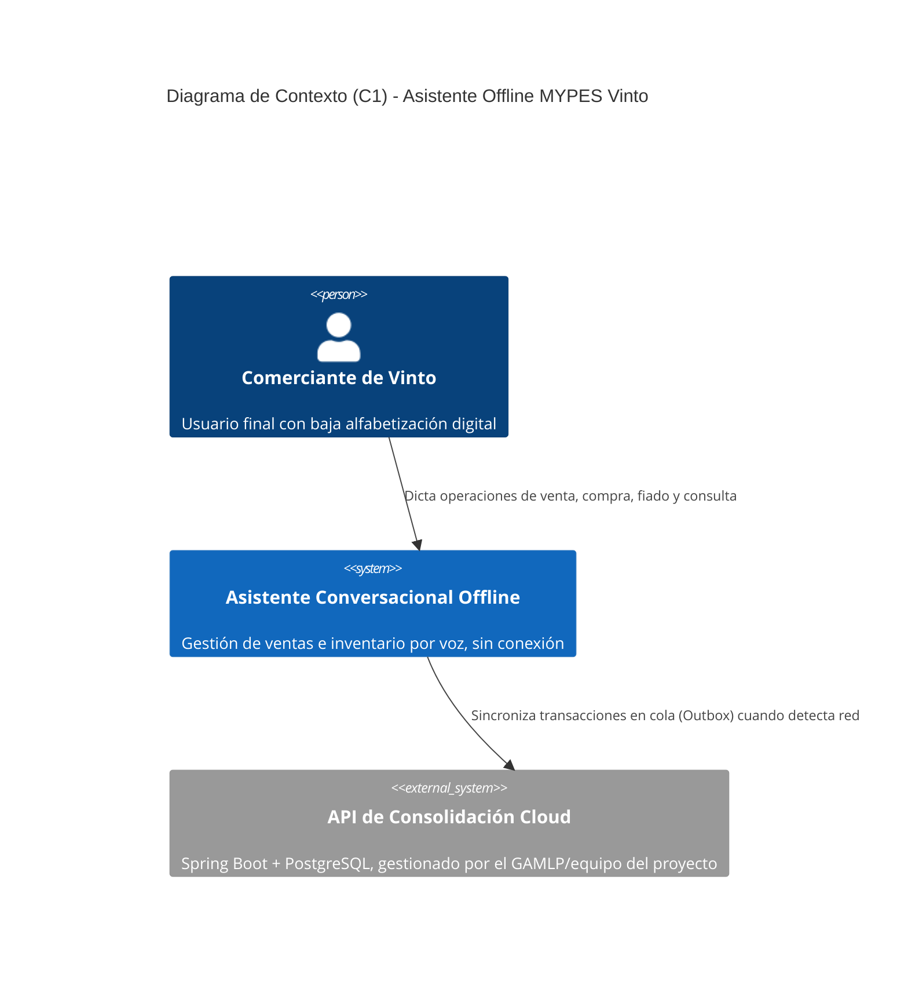
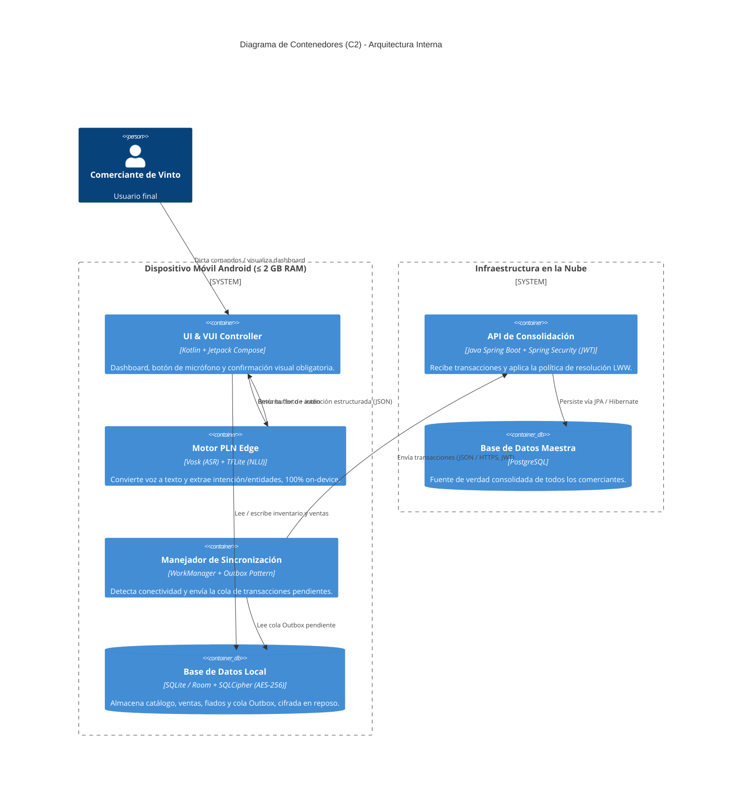

# DOCUMENTO DE ARQUITECTURA DE SOFTWARE (SAD v1.1)

**UNIVERSIDAD ADVENTISTA DE BOLIVIA**
**FACULTAD DE CIENCIAS EXACTAS E INGENIERÍA — CARRERA DE INGENIERÍA EN SISTEMAS**
**ASIGNATURA:** Arquitectura de Software
**PROYECTO:** Proyecto Integrador Semestral — Gestión 2-2026

**SISTEMA:** Asistente Conversacional Offline con Procesamiento de Lenguaje Natural para la Gestión de Ventas e Inventario en MYPES del Centro de Vinto, Cochabamba

**INTEGRANTES:**
- Eva Chino Quispe — Líder de Proyecto, Requisitos y QA Documental
- Christian Gonzales — Ingeniería de IA y Pipeline Conversacional
- Marializ Mamani — Backend, Seguridad y Persistencia de Datos
- Kevin Rocha — Diseño UX/UI y Prototipado
- Luis Lazo — Arquitectura C4 y QA Técnico

**DOCENTE:** _(completar)_
**FECHA DE ENTREGA:** _(completar)_
**VERSIÓN:** 1.1

---

## CONTROL DE VERSIONES

| Versión | Fecha | Autor | Descripción del Cambio |
| :--- | :--- | :--- | :--- |
| 1.0 | _(fecha)_ | Equipo de Proyecto | Versión inicial del SAD. |
| 1.1 | _(fecha)_ | Equipo de Proyecto | Consolidación de las dos versiones previas del SAD en un único documento oficial. Se agrega columna "Artefacto" a los escenarios de calidad (estándar SEI/ATAM), se amplía a 5 tácticas arquitectónicas, se completa la matriz de trazabilidad (RA-01 a RA-05) y se resuelve la inconsistencia tecnológica entre ADR-002 (Vosk+TFLite vs. Gemma 3n) y ADR-003 (Spring Boot vs. Node.js), fijando como stack oficial: **Kotlin Nativo + Vosk/TFLite (edge) + SQLite/Room+SQLCipher + Spring Boot/PostgreSQL**. |

---

## 1. INTRODUCCIÓN

El presente documento describe la arquitectura del **Asistente Conversacional Offline** para la gestión de ventas e inventario en las MYPES del centro de Vinto, Cochabamba. El sistema está diseñado en tecnologías nativas (Kotlin) para operar en dispositivos Android de gama baja, garantizando un consumo menor a 500 MB de RAM y operación 100% offline, con sincronización diferida hacia un backend en la nube cuando exista conectividad.

Esta versión (1.1) es el documento **único y oficial** del SAD; reemplaza y consolida las versiones parciales anteriores del repositorio (`01_Introduccion_y_Contexto.md`, `02_Requisitos_del_Sistema.md`, `04_Arquitectura_SAD_y_UX.md` y la primera versión de `SAD_Arquitectura_Software.md`), que deben archivarse o eliminarse para evitar contradicciones frente al jurado evaluador.

## 2. ANÁLISIS DEL PROBLEMA

### 2.1 Contexto
Vinto concentra microempresas familiares que operan con flujo de caja diario. Los comerciantes poseen teléfonos Android de gama baja (≤ 2 GB RAM), conectividad intermitente y, en muchos casos, baja alfabetización digital.

### 2.2 Problema Principal
El abandono de los sistemas de gestión comercial por parte de los comerciantes de Vinto ocurre **debido a la inadecuación de las arquitecturas de software comerciales frente a estas restricciones técnicas** y a la imposibilidad de interactuar mediante lenguaje natural en las herramientas actuales. Esto perpetúa el uso del cuaderno físico, generando errores de cálculo y pérdida de trazabilidad del negocio.

### 2.3 Causas y Consecuencias
- **Causas:** interfaces gráficas (GUI) complejas; sistemas que exigen hardware superior a 4 GB de RAM y conexión a Internet permanente; baja alfabetización digital de los usuarios objetivo.
- **Consecuencias:** errores de contabilidad manual, mercadería vencida o mal contabilizada, decisiones financieras tomadas "a ciegas".

### 2.4 Oportunidad de Solución
La evolución de la IA "Edge" (on-device) permite incrustar modelos de reconocimiento de voz (Vosk, ~50 MB) y clasificación de intención (TFLite) livianos, habilitando una interfaz conversacional 100% local, sin dependencia de Internet ni costo recurrente de API.

## 3. STAKEHOLDERS

| Stakeholder | Rol | Responsabilidad / Interés |
| :--- | :--- | :--- |
| **Comerciantes de Vinto** | Usuario final | Registrar ventas y controlar stock de forma verbal e intuitiva. |
| **Dueños de negocio** | Beneficiario | Tomar decisiones informadas; reducir pérdidas de mercadería. |
| **Equipo de desarrollo** | Equipo técnico | Implementar la arquitectura Kotlin nativa, el pipeline de PLN y la sincronización. |
| **Docentes UAB** | Evaluador | Validar el rigor arquitectónico, la viabilidad técnica y la defensa oral. |

## 4. ALCANCE

**Incluido:** arquitectura offline-first nativa; pipeline de PLN local (ASR con Vosk, clasificación de intención/entidades con TFLite); persistencia local cifrada (SQLite/Room + SQLCipher); sincronización diferida mediante patrón Outbox y resolución de conflictos LWW (Last Write Wins) contra un backend Spring Boot; confirmación visual obligatoria antes de persistir cualquier transacción dictada por voz.

**Excluido de esta primera entrega:** pasarelas de pago en línea; soporte nativo para iOS o Windows; facturación electrónica (SIN); analítica de negocio (BI) avanzada; el modelo **Gemma 3n** queda registrado como *stretch goal* opcional para fases posteriores, no como parte del pipeline oficial de esta entrega.

## 5. REQUISITOS ARQUITECTÓNICAMENTE SIGNIFICATIVOS (Drivers)

| ID | Requisito | Impacto Arquitectónico | Prioridad |
| :--- | :--- | :--- | :--- |
| **RA-01** | Soportar operación 100 % offline en Android de gama baja | Define Kotlin nativo y persistencia local (SQLite/Room), descartando PWA o soluciones híbridas. | Alta |
| **RA-02** | Procesar voz a texto e intención en el dispositivo, sin red | Define la integración de Vosk (ASR, ~50 MB) + TFLite (clasificador de intención/entidades) incrustados en el APK. | Alta |
| **RA-03** | Evitar inconsistencias de datos al recuperar la conexión | Obliga a implementar patrón Outbox local y resolución de conflictos LWW en el backend Spring Boot. | Alta |
| **RA-04** | Tiempo de respuesta del procesamiento verbal ≤ 2 s | Fuerza la optimización de latencia en la capa de PLN (modelos cuantizados, inferencia en background thread). | Alta |
| **RA-05** | Permitir la incorporación de nuevos módulos (p. ej. reportes avanzados) | Requiere diseño modular y bajo acoplamiento (Clean Architecture + inyección de dependencias). | Media |
| **RA-06** | Garantizar la confidencialidad e integridad de los datos financieros y comerciales | Define cifrado AES-256 en reposo (SQLCipher), TLS 1.3 en tránsito, hashing con sal (Argon2) y Android Keystore (ver ADR-004). *Elaborado por Marializ Mamani.* | Alta |

## 6. ATRIBUTOS DE CALIDAD PRIORIZADOS

| Atributo | Prioridad | Justificación |
| :--- | :--- | :--- |
| **Disponibilidad** | Alta | El sistema debe operar en el mercado sin depender de datos móviles ni Wi-Fi. |
| **Rendimiento** | Alta | La interacción conversacional fluida exige respuestas en ≤ 2 s y consumo < 500 MB de RAM en hardware limitado. |
| **Confiabilidad** | Alta | El sistema debe interpretar correctamente pese al ruido ambiental de mercado y a modismos dialectales locales. |
| **Usabilidad** | Alta | Dirigido a usuarios con baja alfabetización digital; la voz reemplaza formularios complejos. |
| **Seguridad** | Media | Debe proteger la información financiera y de inventario almacenada localmente ante robo o pérdida del dispositivo. |

*Orden de prioridad fundamentado:* 1° Disponibilidad Offline (sin ella el sistema es inutilizable en Vinto), 2° Rendimiento (condiciona la adopción real por parte del usuario), 3° Confiabilidad/Usabilidad (determinan la confianza en los registros de voz), 4° Seguridad (crítica pero secundaria frente a la operatividad diaria del comerciante).

## 7. ESCENARIOS DE CALIDAD

*Estructura ATAM de 7 columnas: Fuente → Estímulo → Entorno → Artefacto → Respuesta → Medida.*

| ID | Atributo | Fuente | Estímulo | Entorno | Artefacto | Respuesta | Medida |
| :--- | :--- | :--- | :--- | :--- | :--- | :--- | :--- |
| **QS-01** | Rendimiento | Usuario | Dicta un comando de voz largo | App en uso normal | Motor PLN Edge (Vosk + TFLite) | Transcribe y extrae intención/entidades | ≤ 2 s de latencia total |
| **QS-02** | Disponibilidad | Usuario | Abre la app sin Wi-Fi/datos | Sin conexión de red | Capa de persistencia local (SQLite/Room) | Todas las vistas y operaciones funcionan sin red | 100 % de las funciones core disponibles |
| **QS-03** | Confiabilidad | Ruido externo (mercado) | Dicta una venta con ruido ambiental | Ambiente ruidoso | Motor ASR Vosk (vocabulario dinámico local) | Extrae producto, cantidad y monto correctos | Precisión de extracción ≥ 85 % |
| **QS-04** | Seguridad | Tercero no autorizado | Robo o pérdida del dispositivo, apagado | Dispositivo fuera de línea | Base de datos local (SQLCipher AES-256) | La base de datos resulta ilegible sin la clave | 100 % de los datos cifrados en reposo |
| **QS-05** | Usabilidad | Usuario (primera vez) | Usa la app por primera vez para registrar una venta | Operación normal | UI & VUI Controller (Jetpack Compose) | Completa el registro sin ayuda externa | Puntaje SUS ≥ 70 pts |

### 7.1 Escenarios de profundización — Seguridad (elaborados por Marializ Mamani)

| ID | Atributo | Estímulo y Entorno | Respuesta Esperada | Medida Propuesta |
| :--- | :--- | :--- | :--- | :--- |
| QS-06 | Seguridad | Atacante externo extrae el archivo SQLite del dispositivo robado o perdido. | Datos cifrados con AES-256, ilegibles sin clave. | Tiempo de crackeo estimado > 100 años por fuerza bruta. |
| QS-07 | Seguridad | El comerciante ingresa un PIN incorrecto 3 veces consecutivas. | El sistema bloquea el acceso temporalmente y registra el intento. | Bloqueo tras 3 intentos; registro de auditoría generado. |
| QS-08 | Seguridad | Ataque Man-in-the-Middle en red WiFi pública durante la sincronización. | TLS 1.3 + Certificate Pinning impide leer o modificar datos en tránsito. | Conexión rechazada sin certificado válido. |
| QS-09 | Seguridad | El sistema detecta privilegios de root/jailbreak al iniciar. | Se muestra advertencia y se limitan funciones críticas. | Detección de root en < 2 s. |

### 7.2 Escenario de profundización — Usabilidad (elaborado por Luis Lazo)

| ID | Atributo | Estímulo y Entorno | Respuesta Esperada | Medida Propuesta |
| :--- | :--- | :--- | :--- | :--- |
| QS-10 | Usabilidad / Sincronización | Usuario nuevo intenta registrar una venta con instrucciones mínimas. | Completa la tarea apoyándose en la confirmación visual y el fallback a teclado. | SUS ≥ 70 y tasa de éxito ≥ 85 % (5 usuarios objetivo). |

## 8. TÁCTICAS ARQUITECTÓNICAS

| Atributo | Problema | Táctica Seleccionada | Justificación |
| :--- | :--- | :--- | :--- |
| **Rendimiento** | Limitación de RAM (< 2 GB) en el dispositivo | **Desarrollo nativo (Kotlin)** | Acceso de bajo nivel para gestionar memoria y garbage collection, evitando la sobrecarga de frameworks híbridos. |
| **Disponibilidad** | Ausencia de conexión a Internet | **Offline-First (base de datos embebida)** | SQLite/Room actúa como fuente de verdad local mientras no hay red. |
| **Confiabilidad** | Falsos positivos por ruido/mala transcripción | **Confirmación visual obligatoria** | Tarjeta de UI grande que exige confirmación explícita antes de persistir cualquier transacción dictada. |
| **Confiabilidad** | Modismos y unidades dialectales no reconocidas | **Vocabulario dinámico (fine-tuning ligero)** | Configuración de Vosk con términos locales ("cuartilla", "casera", "fiado", "amarrito"). |
| **Modificabilidad / RA-05** | Nuevos módulos futuros afectan varios componentes | **Encapsulamiento + Clean Architecture** | Separación en capas (Presentación / Dominio / Datos) que aísla el impacto de cambios a un solo módulo. |
| **Seguridad** | Interceptación de datos en la sincronización (red pública) | **TLS 1.3 + Certificate Pinning** | Previene ataques Man-in-the-Middle en redes públicas (QS-08). |
| **Seguridad** | Acceso no autorizado mediante PIN comprometido | **Hashing con sal (Argon2) + bloqueo temporal** | PIN almacenado como hash irreversible; bloqueo de 30 s tras 3 intentos fallidos (QS-07). |
| **Seguridad** | Ejecución en dispositivos comprometidos (root/jailbreak) | **Detección de Root + restricción de funciones** | Previene la ejecución en dispositivos con privilegios elevados (QS-09). |

*Las tres últimas tácticas de Seguridad fueron elaboradas por Marializ Mamani.*

## 9. DECISIONES ARQUITECTÓNICAS INICIALES (ADRs)

### ADR-001: Tecnología Móvil — Nativo vs. Híbrido
- **Estatus:** Aprobado
- **Contexto:** Los dispositivos de Vinto tienen severas restricciones de RAM (≤ 2 GB) y procesadores antiguos.
- **Decisión:** Utilizar **Kotlin nativo** con Jetpack Compose.
- **Alternativas consideradas:** React Native, Flutter, PWA.
- **Justificación:** PWA y los frameworks híbridos añaden sobrecarga de memoria (WebView/Bridge/motor JS) que compromete el cumplimiento de RNF-001 (RAM < 500 MB). Kotlin nativo da control directo sobre el ciclo de vida y la memoria.
- **Consecuencias:** desarrollo acoplado a Android; no habrá versión web ni iOS en esta fase.

### ADR-002: Pipeline de PLN — Cloud vs. Edge
- **Estatus:** Aprobado
- **Contexto:** El reconocimiento de voz tradicionalmente depende de APIs en la nube (Google Speech, Whisper Cloud), lo cual exige Internet permanente.
- **Decisión:** Ejecutar el pipeline **100 % on-device**: **Vosk** (modelo `vosk-model-small-es-0.42`, ~40-50 MB) para ASR y un clasificador **TFLite** propio para intención y extracción de entidades. Toda transcripción con confianza < 0.75 dispara el flujo de aclaración o el fallback a teclado (RF-010).
- **Alternativas consideradas:** API de Google Speech, OpenAI Whisper Cloud, modelo Gemma 3n on-device.
- **Justificación:** garantiza disponibilidad offline total, privacidad de los datos del comerciante y costo marginal cero por transacción. Gemma 3n se evaluó pero se descartó para esta entrega por su mayor huella de memoria y madurez de soporte en gama baja; queda documentado como *stretch goal*.
- **Consecuencias:** aumenta el peso del APK (~70 MB adicionales); exige optimización de batería y RAM.

### ADR-003: Arquitectura de Sincronización y Backend
- **Estatus:** Aprobado
- **Contexto:** El usuario genera datos offline y se conecta a la red de forma intermitente; se requiere un backend central que consolide la información de todos los comerciantes.
- **Decisión:** Patrón **Outbox** local (cola en SQLite), cada operación identificada con **UUID v4** (clave de idempotencia), reintentos con **backoff exponencial** (1s → 4s → 16s → máx. 5 intentos) y resolución de conflictos **LWW (Last Write Wins)** con reconciliación asistida para casos críticos (p. ej. stock que resultaría negativo), consumido por un backend **Java Spring Boot + Spring Data JPA** sobre **PostgreSQL**.
- **Alternativas consideradas:** CQRS con Axon Framework; Couchbase Sync Gateway; backend Node.js/Python con REST simple.
- **Justificación:** Axon/Couchbase añaden complejidad de infraestructura injustificada para el alcance de un semestre. Frente a Node.js/Python, Spring Boot fue elegido por la solidez de su ecosistema de seguridad (Spring Security + JWT), su integración madura con JPA/PostgreSQL y porque el equipo de backend (Marializ Mamani) ya lo domina, reduciendo el riesgo técnico del proyecto.
- **Consecuencias:** conflictos de sincronización extremadamente raros (mismo producto editado offline por dos dispositivos) requerirán reconciliación manual administrativa.

### ADR-004: Cifrado de Base de Datos Local — SQLCipher AES-256 vs. Nube (elaborado por Marializ Mamani)
- **Estatus:** Aprobado
- **Contexto:** Las MYPES de Vinto manejan información financiera sensible en dispositivos con riesgo real de pérdida o robo.
- **Decisión:** Arquitectura híbrida de 4 capas: (1) cifrado en reposo SQLite + SQLCipher AES-256; (2) cifrado en tránsito TLS 1.3; (3) clave maestra en Android Keystore; (4) autenticación por PIN de 4 dígitos con hash Argon2.
- **Alternativas consideradas:**

  | Alternativa | Ventajas | Desventajas |
  | :--- | :--- | :--- |
  | Solo Nube | Cifrado gestionado por el proveedor | Inoperable sin Internet (viola RA-01); costos recurrentes |
  | Local sin cifrado | Máximo rendimiento | Datos expuestos ante robo; incumple RA-02/RA-06 |
  | **SQLCipher + Nube (elegida)** | 100% offline; datos protegidos en reposo y tránsito; costo cero | Overhead ~10-15%; complejidad en gestión de claves |
- **Justificación:** satisface RA-01 y RA-06; resuelve los escenarios QS-06 a QS-09; SQLCipher es 100% compatible con Room, sin introducir un motor de persistencia adicional.
- **Consecuencias:** +2-3 MB en el APK; mayor complejidad en la derivación de la clave desde el PIN, mitigada con pruebas de benchmark en dispositivos de 2 GB de RAM.

## 10. MODELO C4

*(Diagramas codificados en Mermaid; se renderizan automáticamente en GitHub).*

### 10.1 C1 — Diagrama de Contexto

### 10.2 C2 — Diagrama de Contenedores

## 11. TRAZABILIDAD ARQUITECTÓNICA

| Requisito | Atributo | Escenario | Táctica | Decisión | Contenedor C2 |
| :--- | :--- | :--- | :--- | :--- | :--- |
| RA-01 | Disponibilidad | QS-02 | Offline-First | ADR-001 | Base de Datos Local (SQLite/Room) |
| RA-02 | Rendimiento | QS-01 | Desarrollo Nativo (Kotlin) | ADR-002 | Motor PLN Edge |
| RA-03 | Confiabilidad | QS-03 | Vocabulario dinámico / Outbox + LWW | ADR-003 | Manejador de Sincronización → API Spring Boot |
| RA-04 | Rendimiento | QS-01 | Desarrollo Nativo (Kotlin) | ADR-002 | Motor PLN Edge |
| RA-05 | Modificabilidad | QS-05 | Encapsulamiento / Clean Architecture | ADR-001 | UI & VUI Controller |
| RA-06 | Seguridad | QS-06 a QS-09 | TLS 1.3 + Pinning / Argon2 / Detección de Root | ADR-004 | Base de Datos Local + API de Consolidación |

## 12. RETOS ARQUITECTÓNICOS

*Elaborado por Luis Lazo (Arquitectura C4 y QA Técnico).*

### Reto 1 — Restricciones de Hardware Android de Gama Baja
- **Contexto:** dispositivos de 2-3 GB de RAM, procesadores MediaTek/Helio de entrada, muchos con más de 3 años de uso.
- **Desafío:** ejecutar Vosk + TFLite + pipeline conversacional con RAM < 300 MB y respuesta ≤ 2 s.
- **Estrategia:** carga de modelos bajo demanda (lazy loading); WorkManager para tareas pesadas; monitoreo con `Debug.getMemoryInfo()`; fallback automático a teclado ante presión de memoria.
- **Verificación:** QS-01, en Samsung A03 / Xiaomi Redmi 9A. **Riesgo residual:** cierres por falta de memoria (OOM), rechazo del producto.

### Reto 2 — Ruido Acústico Ambiental en Mercados
- **Contexto:** ruido ambiental > 70 dB en mercados y tiendas de barrio.
- **Desafío:** mantener una tasa de reconocimiento aceptable sin depender de servicios cloud.
- **Estrategia:** preprocesamiento de audio (16 kHz, mono, PCM 16-bit + filtro paso-banda); modelo `vosk-model-small-es-0.42` (~40 MB); detección de actividad de voz (VAD); umbral de confianza ≥ 0.75 con fallback a teclado.
- **Verificación:** QS-01 y QS-03, con corpus de audio real de mercados de Vinto. **Riesgo residual:** interpretaciones erróneas que generen ventas o descuentos incorrectos.

### Reto 3 — Consistencia Eventual en Modo Offline-First
- **Contexto:** operaciones generadas offline que se sincronizan de forma diferida; posibles conflictos de concurrencia.
- **Desafío:** evitar duplicidad de ventas y garantizar convergencia del inventario local/remoto.
- **Estrategia:** patrón Outbox (ADR-003); UUID v4 de idempotencia; estados de sincronización visibles en UI; LWW con reconciliación asistida; backoff exponencial (1s→4s→16s→máx. 5).
- **Verificación:** QS-02 y escenario de sincronización, con pruebas de idempotencia y corte de red simulado. **Riesgo residual:** duplicación de ventas, descuadre de inventario.

## 13. REFERENCIAS

- Bass, L., Clements, P., & Kazman, R. — *Software Architecture in Practice*.
- Sommerville, I. — *Ingeniería de Software*.
- Instituto Nacional de Estadística (INE) — Bolivia. _(citar dato específico usado sobre Vinto/Cochabamba)_.
- Autoridad de Transporte y Telecomunicaciones (ATT) — Bolivia. _(citar dato de cobertura/conectividad si se usó)_.

*(Completar en formato IEEE con los datos exactos de las fuentes citadas en la sección 2.)*

---
*Arquitectura de Software — Proyecto Integrador — Documento consolidado v1.1*
